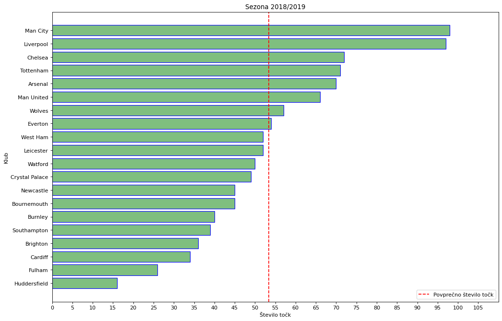
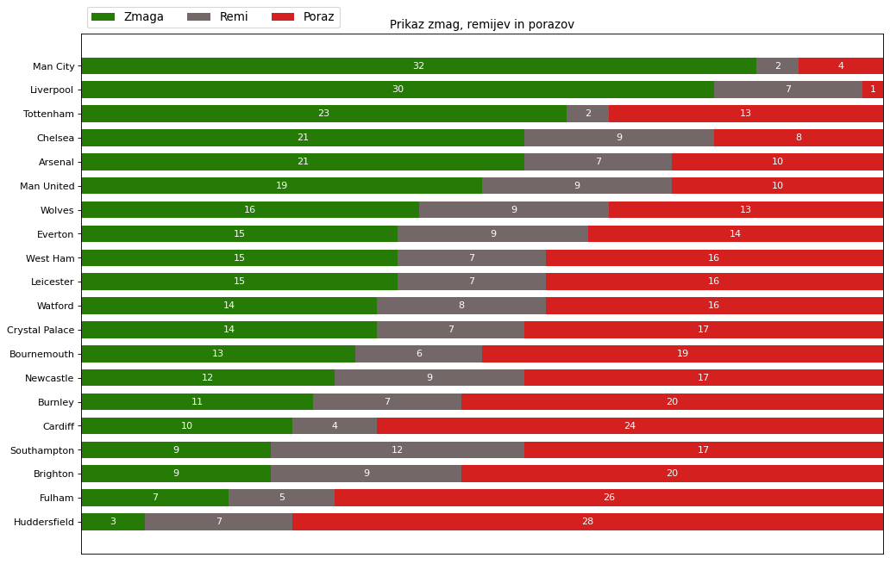
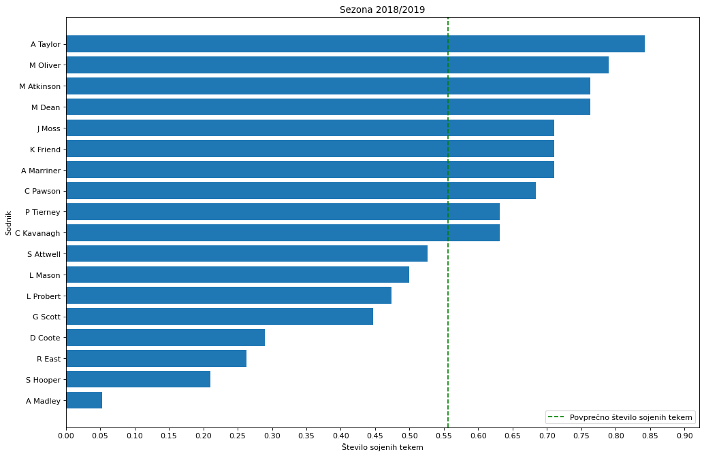
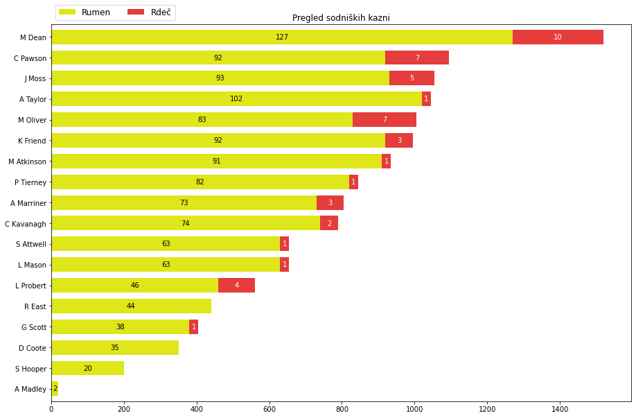
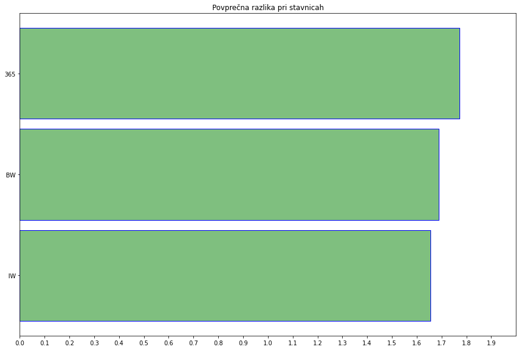

# PR20ZJMHZK
## Skupina

 * Žan Jurečič
 * Matic Hrastelj
 * Žan Korošak

## Opis problema
Ukvarjali se bomo z analizo in predstavitvijo podatkov iz angleške Premier lige. 
Naši podatki vsebujejo igrane tekme od leta 2015 do leta 2019 in sicer:
  * Datum
  * Nastopajoče ekipe
  * Glaven sodnik
  * Statistika tekme
  * Podatki o napovedih stavnic 
  * itd.
  
Naši osnovni cilji bodo:
  * Analiza učinkovitosti ekip v sezoni 18/19 v primerjavi s prejšnjimi leti, ter spremembe v stilu igranja
  * Analiza kakovosti sodnikov
  * Statistika uspehov, neuspehov ter presenečenj
  * Analiza popularnih stavnic skozi sezono
  * Napoved sezone 19/20
  * itd.
  
  ### Priprava podatkov
  Posamezne ekipe ter sodnike smo realizirali z objekti. Vsaka posamezna ekipa je torej svoj objekt, ki hrani vse podatke o ekipi. <br>
  Podatke smo shranili v več slovarjev. Imamo 3 glavne slovarje, v katerih so shranjeni vsi klubi z njihovimi objekti, vsi sodniki z objekti ter glavne 3 stavnice. 
  
Najprej smo podatke spravili v spremenljivke.
```python
def read_data(data):
    referee_dict = {}
    teams_dict = {}
    betting_sites = {"365": 0, "IW": 0, "BW": 0}
    
    for row in data:
        div = row["Div"]
        date = row["Date"]
        home_team = row["HomeTeam"]
        away_team = row["AwayTeam"]
        full_time_home_goals = row["FTHG"]
          ..........
        draw_BW = row["BWD"]
        away_BW = row["BWA"]
```
Nato smo pa med branjem posodabljali slovarje z novimi podatki:
```python
        curr_match = Match(date, home_team, away_team, full_time_home_goals, full_time_away_goals, full_time_result,
                           half_time_home_goals, half_time_result, hts, ats,
                           hst, ast, hc, ac, home_fouls, af, home_yellow, away_yellow, home_red, away_red)

        referee_dict[referee].add_all([home_yellow, away_yellow, home_red, away_red], curr_match)
        
        if full_time_result == "H":
            curr_home_team.win += 1
            curr_away_team.loss += 1
            
            betting_sites["365"] += float(home_365) - 1
            betting_sites["IW"] += float(home_IW) - 1
            betting_sites["BW"] += float(home_BW) - 1

            
        curr_home_team.add_all(full_time_home_goals, full_time_away_goals,
                               home_yellow, home_red)
        curr_away_team.add_all(full_time_away_goals, full_time_home_goals,
                               away_yellow, away_red)
```
Za začetek smo za sezono 2018/2019 prikazali razporeditev klubov na lestvici z njihovimi točkami:
```python
  p, t = zip(*sorted([[a,b] for a, b in zip(p, t)], key=lambda item: item[0], reverse=False))
  plt.barh(t, p,color=(0, 0.5, 0, 0.5), edgecolor='blue')
  plt.axvline(x=np.mean(p), label="Povprečno število točk", c='r', linestyle="--")
```


Prikazali smo kako so ekipe pridobile svoje točke v naslednji porazdelitvi:
```python
for i, (colname, color) in enumerate(zip(category_names, category_colors)):
        widths = data[:, i]
        starts = data_cum[:, i] - widths
        plt.barh(labels, widths, left=starts, height=0.7,
                label=colname, color=color)
        xcenters = starts + widths / 2
        r, g, b, _ = color
        text_color = 'white'
        for y, (x, c) in enumerate(zip(xcenters, widths)):
            plt.text(x, y, str(int(c)), ha='center', va='center',
                    color=text_color)
            plt.legend(ncol=len(category_names), bbox_to_anchor=(0, 1),
                  loc='lower left', fontsize='large')

```


 
Na naslednjem grafu smo predstavili povprečno število sojenih tekem sodnikov:
```python
    season = sorted([(k,v) for k,v in season.items()], key=lambda item: len(item[1].refereed_games),reverse=False)
    sodniki = [k for k,v in season]
    tekme = [len(v.refereed_games)/38 for k,v in season]
    plt.barh(sodniki, tekme)
    plt.axvline(x=np.mean(tekme), label="Povprečno število sojenih tekem", c='g', linestyle="--")
```


Na naslednjem grafu nam števila na x osi povejo kakšen je izračun skupnih kazni, ki so jih sodniki izvedli, kjer so rumeni kartoni vredni 10 točk in rdeči 25:
```python
    df0 = pd.DataFrame({'Rumen':yellows,'Rdeč':red}, columns=['Rumen', 'Rdeč'],
                       index=sodniki)
    df0.plot.barh(ax=ax, stacked=True, color=category_colors, width=0.7)
        for y, (yellow, redC) in enumerate(zip(yellows, red)):        
        ax.text(yellow/2, y, str(int(yellow/10)), ha='center', va='center',
                    color='black')
        if redC > 0:
             ax.text(yellow + redC/2, y, str(int(redC/25)), ha='center', va='center',
                     color='white')   
```


Nazadnje smo pa še prikazali kako pravilno so stavnice napovedovale rezultate skozi sezono 2018/2019. X vrednost nam pove kakšna je bila razlika med kvoto posamezne stavnice ter pravilnim rezultatom (1):

```python
 sites = [k for k,v in sorted(betting_sites.items(), key=lambda item:item[1], reverse=False)]
 sums = [v/380 for k,v in sorted(betting_sites.items(), key=lambda item:item[1], reverse=False)]
 plt.barh(sites, sums,color=(0, 0.5, 0, 0.5), edgecolor='blue', height=0.9)
```


## Glavne ugotovitve
  * Ugotovili smo  da povprečni sodnik sodi vsaki drugi teden, torej eno tekmo na dva tedna, iz česar lahko sklepamo, kateri sodniki so najbolj izkušeni ter morda tudi najbolj utrujeni, kar lahko kasneje povežemo z sojenjem bolj pomembnih tekem.
  * Ponazorili smo kateri sodniki so bolj nagnjeni k tem da pustijo grobo igro, ter izkjučitvi igralcev, iz česar lahko izvemo da izkušeni sodniki večkrat izključijo igralce in tisti z manj izkušnjami veliko manj saj se morda bojijo.
  * Iz grafov o stavnicah smo ugotovili kje se je najbolj splačalo staviti v sezoni 2018/2019 in katera stavnica se je najbolj približala dejanskim rezultatom.

## Cilji v prihodnosti
 * Prikaz sprememb na lestvici skozi sezono
 * Iskanje povezav med izbiro sodnika ter pomembnostjo tekme
 * Analiza ekip, ki so napredovala iz druge lige
 * Prikaz razdelitve navijačev v Veliki Britaniji
 * Napoved sezone 19/20 z uporabo podatkov prejšnjih sezon


